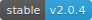

<!-- Screenshot -->
<p align="center">
    
</p>

<!-- Badges -->
<p align="center">
  
  
</p>

# Snowflake

This package enables a Laravel application to create Twitter Snowflake identifiers. It is a very thin wrapper around the excellent [Snowflake PHP](https://github.com/godruoyi/php-snowflake) library created by Godruoyi.

## What are Snowflakes?

Snowflakes are a form of unique identifier devised by Twitter. In this respect, they are similar to other unique identifier algorithms such as UUID or ULID.

## Why should I use them?

I've written an [article](https://itnext.io/choosing-the-right-data-type-means-of-generating-unique-primary-keys-d7aac92968c6) exploring the benefits of Snowflakes over other unique identifiers. However, in short:

- They consists entirely of integers.
- They uses less space (16 characters, so it fits in a `BIGINT`).
- Indexing of integers is much faster than indexing a string.
- Keys begin with a timestamp, so are sortable.
- Keys end with a random number, so guessing table size is not possible.
- Databases handle integers more efficiently than strings.
- Generation of new keys is faster (less than 1 ms).

## Installation

Pull in the package using Composer:

```bash
composer require mattkingshott/snowflake
```

## Configuration

Snowflake includes a configuration file that allows you to set:

1. The data center number.
2. The worker node number.
3. The starting timestamp.
4. The sequence resolver.

Most developers won't need to alter these values unless they need to set up a distributed architecture for generating Snowflakes.

If you want to change any of the values, publish the configuration file using Artisan:

```bash
php artisan vendor:publish
```

## Usage

You can generate a Snowflake by resolving the service out of the container and calling its `id` method:

```php
resolve('snowflake')->id(); // (string) "5585066784854016"
```

Since this is a little cumbersome, the package also registers a global `snowflake()` helper method that you can use anywhere. This helper also converts the Snowflake from a `string` into an `integer`, which better reflects its data type:

```php
snowflake(); // (int) 5585066784854016
```

### Eloquent models

If you want to use a Snowflake as the primary key for an Eloquent model, then you'll need to perform a couple of steps.

First, modify the model's migration so that it no longer uses auto-incrementing integers e.g.

```php
// Before
$table->id();

// After
$table->unsignedBigInteger('id')->primary();
```

Here's an example:

```php
class CreateUsersTable extends Migration
{
    public function up()
    {
        Schema::create('users', function(Blueprint $table) {
            $table->unsignedBigInteger('id')->primary();
            $table->string('name', 100);
            $table->timestamps();
        });
    }
}
```

Finally, add the package's `Snowflakes` trait to the model:

```php
<?php

namespace App\Models;

use Snowflake\Snowflakes;

class User extends Model
{
    use Snowflakes;
}
```

## Contributing

Thank you for considering a contribution to Snowflake. You are welcome to submit a PR containing improvements, however if they are substantial in nature, please also be sure to include a test or tests.

## Support the project

If you'd like to support the development of Snowflake, then please consider [sponsoring me](https://www.paypal.com/cgi-bin/webscr?cmd=_s-xclick&hosted_button_id=YBEHLHPF3GUVY&source=url). Thanks so much!

## License

The MIT License (MIT). Please see [License File](LICENSE.md) for more information.